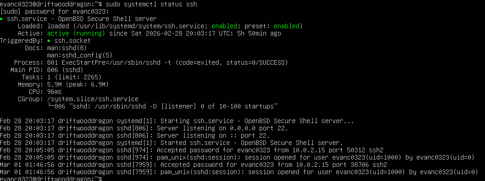
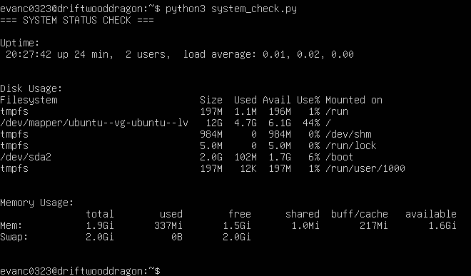

> Screenshots included below for validation and proof of execution


SSH & System Monitoring Automation


Objective

Simulate real-world IT administrative tasks by:
Enabling and verifying SSH remote access


Connecting to a Linux server remotely


Performing system health checks


Automating monitoring tasks using Python


Documenting results for reproducibility

Environment
Hypervisor: Oracle VM VirtualBox


OS: Ubuntu Server LTS


Resources: 2GB RAM, 20GB Storage


Network Mode: NAT (DHCP Assigned IP)


Python Version: python3 --version


## Part 1 – SSH Configuration & Verification
## 1. Verified SSH Service Status
bash
sudo systemctl status ssh


Purpose: Confirm whether the SSH service is installed and running.
If inactive, installed and enabled SSH: 
```bash 
sudo apt update
sudo apt install openssh-server -y
sudo systemctl enable ssh
sudo systemctl start ssh
```
Outcome: SSH service confirmed active and enabled on boot.


##  2. Identified Server IP Address
```bash
ip a
```
Purpose: Identify the server’s assigned IP address under DHCP.
Result: Located inet address under network interface (e.g., enp0s3).


## 3. Remote SSH Login from Host Machine
From Windows PowerShell:
```Powershell 
ssh  evanc0323@10.0.2.15
```
Purpose: Simulate remote server administration.
Outcome: Successfully authenticated and accessed the server remotely.

Part 2 – Manual System Monitoring
Check Uptime
```bash 
Uptime
```
Purpose: Displays how long the server has been running and load averages.
Monitor CPU & Memory
``` bash 
	-top
```
Provides live system resource usage including:
CPU utilization


Running processes


Memory consumption
Check Disk Usage
```bash 
df -h
```
Purpose: Shows disk space usage in human-readable format.

Check Memory Usage
```bash 
free -h
```


## Part 3 – Python System Health Automation
Created Script File
``` bash 
nano system_check.py
```
Python Script
```python 
import os
print("=== SYSTEM STATUS CHECK ===\n")

# Uptime
print("Uptime:")
os.system("uptime")
print("\n")

# Disk Usage
print("Disk Usage:")
os.system("df -h")
print("\n")

# Memory Usage
print("Memory Usage:")
os.system("free -h")
print("\n")
```
Executed script
```bash
python3 system_check.py
```


## SSH Connection Successful



## Python Automation Output


